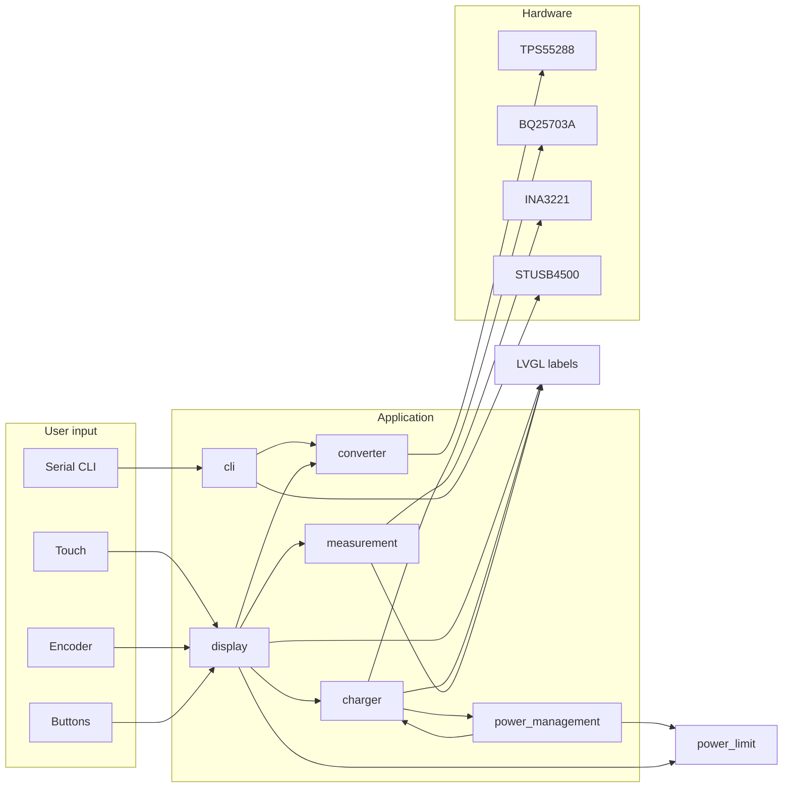

# ESP32 Firmware – Project Explanation

## Project overview

This firmware runs on an **ESP32-S2** and implements a **lab power supply / measurement device** ("fyz-lab-pripravek"). It accepts USB Power Delivery (USB-PD) input, charges an internal battery via a BQ25703A charger IC, and provides a programmable voltage and current output via a TPS55288 DC-DC converter. Three channels are measured with an INA3221 (voltage and current). The user interface is a touchscreen (TFT + resistive touch) with LVGL, plus physical buttons and an encoder; a serial CLI allows remote control and debugging. A NeoPixel LED indicates status.

---

## Hardware and dependencies

### Board and pins

| Item | Details |
|------|---------|
| Board | ESP32-S2-Saola-1 (Arduino framework, PlatformIO) |
| I2C (main) | Wire: SDA 34, SCL 33, 100 kHz |
| Converter enable | GPIO 13 (high = converter powered) |
| Display | TFT_eSPI (resolution 320×480, rotation in LVGL) |
| Touch | XPT2046 resistive, SPI (e.g. CS pin 2) |
| NeoPixel | GPIO 9, 1 LED |
| Encoder | Pins 3 and 4 (half-quad), button on GPIO 5 |
| Buttons | GPIO 1, 2, 45, 18 (BTN_1 … BTN_4); encoder button GPIO 5 |

### I2C devices

| Device | Address | Bus | Role |
|--------|---------|-----|------|
| TPS55288 | 0x75 | Wire | DC-DC converter (voltage/current set, enable) |
| BQ25703A | 0x6B | Wire | Battery charger; ADC for VBUS, VBAT, VSYS, ICHG |
| INA3221 | 0x40 | Wire | 3-channel voltage/current measurement |
| STUSB4500 | 0x28 | Wire1 (26/21) | USB-PD negotiation |

### Key libraries

- **TFT_eSPI**, **LVGL** (9.x) – display and UI  
- **XPT2046_Touchscreen** – resistive touch  
- **Adafruit INA3221** – 3-channel V/I  
- **SparkFun STUSB4500** – USB-PD  
- **spacehuhn/SimpleCLI** – serial CLI  
- **sstaub/Ticker** – periodic tasks  
- **Adafruit NeoPixel** – status LED  
- **ESP32Encoder** – rotary encoder  

---

## Module breakdown

### main.cpp

- **Setup order**: GPIO 13 high (converter power), Wire begin, Serial 115200, `setup_display()` (TFT, touch, calibration, LVGL init), `setup_neopixel()`, `setup_cli()`, `setup_charger()`, `measurement_setup()`, `setup_ui()`. Converter is then disabled; four Tickers are started.
- **Globals**: `TPS55288 converter` (single instance), `bool stopLoop` (CLI “halt” pauses main loop except CLI).
- **Tickers**:  
  - `print_info` every 700 ms (charger, measurements, converter to Serial)  
  - `update_neopixel` every 30 ms (breathing LED)  
  - `update_display` every 200 ms (refresh LVGL readouts)  
  - `power_management_update` every 1000 ms (charger state, power limit, battery flags)
- **Loop**: `handle_cli()`, ticker updates, `handleUserInput()`, `lv_timer_handler()`, `ui_tick()`.

### charger (include/charger.h, src/charger.cpp)

- **BQ25703A** over I2C: register defines, `write_register` / `read_register` (16-bit).
- **setup_charger()**: Detects device, sets min system voltage, charge options, ADC options, max charge voltage/current; on failure blocks with `while(1)`.
- **read_charger(vbus_mv, vbat_mv, vsys_mv, ichg_ma)**: Reads ADC registers and fills pointers (mV, mA).
- **print_charger()**, **bq25703aRegisterDump()**: Serial debug.

### converter (include/converter.h, src/converter.cpp)

- **TPS55288** class: I2C (TwoWire), voltage set (VREF calculation from datasheet), current limit (rounded steps), enable/disable.
- **enable() / disable()**: Set GPIO 13 and MODE register OE bit; currently also update LVGL `objects.output_enable` (label text ON/OFF and checked state), so the driver depends on `ui.h`.
- **setVoltage(float)**, **setCurrentLimit(float)**: Only take effect when converter is enabled. Member fields `voltage` and `current` hold the requested values.

### measurement (include/measurement.h, src/measurement.cpp)

- **Adafruit_INA3221** at 0x40 on Wire; 16-sample averaging.
- **Shunt resistances**: Channel 0: 0.01 Ω, 1: 0.05 Ω, 2: 1 Ω.
- **getMeasurements(voltages, currents)**: Fills two float arrays (3 elements each): voltages in V, currents in mA.
- **measurement_setup()**: begin, averaging, shunt values; blocks on failure.
- **printMeasurements()**: Serial dump of all three channels.

### power_management (include/power_management.h, src/power_management.cpp)

- **power_management_update()**: Calls `read_charger()`, then:
  - Sets `charging` and `power_limit` (20 W base + battery charge power when charging, else 20 W).
  - Sets `low_bat` / `critical_bat` and reduces `power_limit` at 7000 mV and 6800 mV.
- **Globals**: `int power_limit`, `bool charging`, `low_bat`, `critical_bat` (used by display and current-limit logic).
- **Bug**: Currently calls `setup_charger()` at the end of every run (once per second), re-initializing the charger repeatedly; should be removed.

### usb_pd (include/usb_pd.h, src/usb_pd.cpp)

- **STUSB4500** on Wire1 (SDA 26, SCL 21, 100 kHz).
- **setup_usb()**: begin, write default, set PDO count and voltage (e.g. 9 V), soft reset, write. Not called from `main.cpp` (commented out), so the `pd` CLI command operates on an uninitialized device unless `setup_usb()` is enabled elsewhere.

### cli (include/cli.h, src/cli.cpp)

- **SimpleCLI**: Commands `ping`, `source`, `out`, `halt`, `reset`, `pd`.
- **source v i**: Set converter voltage (V) and/or current (mA); NAN skips that argument.
- **out**: Toggle converter enable/disable.
- **halt**: Toggle `stopLoop` (pause/resume main loop except CLI).
- **reset**: `ESP.restart()`.
- **pd v**: Set USB-PD voltage (uses `usb`; requires `setup_usb()` to have been called).
- Uses global `converter` and `usb`.

### display (include/display.h, src/display.cpp)

- **TFT_eSPI**, **XPT2046** touch, **LVGL** with partial buffer (1/10 screen), tick from `millis()`.
- **setup_display()**: Encoder, button pins, interrupts (CHANGE), touch begin, TFT init, **cal_display()** (touch calibration from NVS or 4-point calibration), LVGL init, display and input device registration.
- **cal_display()**: Loads or performs 4-point touch calibration; stores min/max X/Y in NVS namespace `touchcal`. `RECALIBRATE` in display.h forces recalibration when 1.
- **setup_ui()**: `ui_init()`, sets initial V/I labels from `converter`, sets `VoltageSet`/`CurrentSet`.
- **handleUserInput()**: State machine (MODE_IDLE, MODE_VOLTAGE_SETTING, MODE_CURRENT_SETTING). BTN3 short/long switches to voltage/current setting; encoder adjusts value; encoder short confirms and writes to converter. Encoder long toggles output enable. Button flags are cleared when consumed.
- **update_display()**: Enforces power limit (reduces current if V×I ≥ power_limit, shows overpower alert); updates charger readouts (input V, battery %), INA3221 channel readouts (V/I for source and two channels), and alert position/timing. Formatting uses repeated sprintf patterns; one branch incorrectly uses `currents[0]` for channel 2 formatting.
- **Button/encoder**: Internal `ButtonState` structs and volatile short/long press flags; ISRs call a shared `handleButtonEdge` with debounce (DEBOUNCE_MS) and long-press threshold (LONG_PRESS_MS).

### lib/ui (screens, structs, styles, fonts, images)

- **screens.c/h**: `create_screen_main()`, `objects_t objects` – LVGL object tree for one main screen: panels (zdroj_panel, kanal1, kanal2), labels for V/I set (`v_set`, `i_set`), readouts (`v_readout_source`, `i_readout_source`, `v_readout_1`, `i_readout_1`, `v_readout_2`, `i_readout_2`), `input_v_readout`, `charge_indicator`, `output_enable`, `overpower_alert`, etc. Naming is EEZ Studio–style (Czech: zdroj = source, proud = current, napeti = voltage).
- **ui_init()**, **ui_tick()**, **loadScreen()**: Entry points from main and display; screen creation and tick.

---

## Data flow

- User input (Serial, touch, encoder, buttons) drives CLI and display. CLI and display both control the converter (voltage, current, enable).
- Power management reads the charger and updates `power_limit`, `charging`, and battery flags; display and current-limit logic use these.
- Display periodically reads charger and INA3221 and updates LVGL labels; converter enable/disable also updates the output_enable label.

---

## Build and run

- **Build**: `pio run` (or `platformio run`) from the project root (`esp32-firmware`).
- **Upload**: `pio run -t upload`.
- **Monitor**: `pio device monitor` (115200 baud; `monitor_speed = 115200` in platformio.ini).
- **Libraries**: See `platformio.ini` `lib_deps` (TFT_eSPI, LVGL, SimpleCLI, Adafruit INA3221, SparkFun STUSB4500, Adafruit NeoPixel, Ticker, XPT2046_Touchscreen, ESP32Encoder).
